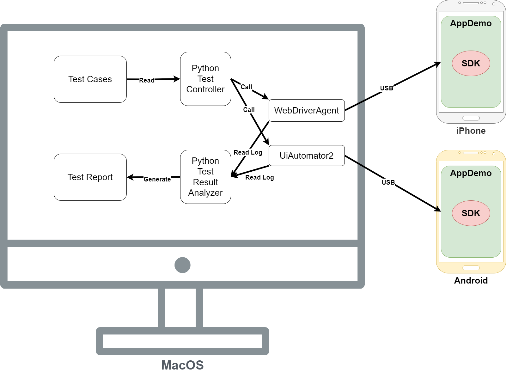

# A Mobile Automation Testing Solution for SDK Product

## Introduction

In today's fast-paced software development environment, SDK(Software Development Kit) products for businesses and developers need many APIs to meet different user needs. These APIs change quickly during the customer amount of the SDK is growing, so we need good testing strategies to make sure everything works reliably. Ensuring the quality and reliability of mobile applications is crucial, especially for SDKs. This article explores our implementation of an automated testing framework that helps validate SDK functionality, ensure reliability, and catch issues early in the development cycle.

## The Importance of Automated Testing

### Reduce Manual Testing Effort

Since SDKs have many interfaces (potentially hundreds of them), manual testing is time-consuming, expensive, and makes it difficult to ensure test stability and repeatability. Therefore, automated testing is the best solution in this situation. Musti (2021), from RV College of Engineering, Bengaluru, said "The manual software testing at times is less accurate and also consumes quite a lot of time which is not desirable in projects where agile methodology is practiced. Hence automation becomes inevitable" (Musti, 2021, p.3). Automation significantly reduces the need for manual testing while improving accuracy.

### Validate SDK API Functionality

When testing a real-time audio/video SDK, it is crucial to validate API functionality, including functions for Audio sampling, encoding/decoding, and playback, video capture, encoding/decoding, rendering, network transmission and Congestion control, Jitter buffer management. Additionally, SDKs often provide numerous interfaces to support diverse industry use cases and handle complex calling logic. Our testing solution is designed to verify each SDK API endpoint and ensure that all functions work as documented.

### Ensure SDK Reliability and Stability

Beyond testing API functionality, It is also essential to ensure SDK stability during long-running sessions and high-frequency calling scenarios. This requires highly precise automation. SDK stability is assessed by tracking system health over extended periods and measuring quality metrics under high-frequency usage.

```python
# This code demonstrates a test case for a long-running video call session
class TestRtcVideoCall(unittest.TestCase):
    def test_long_running_session(self):
        # Test 24-hour continuous connection
        self.start_session()

        for hour in range(24):
            metrics = self.collect_performance_metrics()
            assert metrics['connection_status'] == 'connected'
            assert metrics['packet_loss'] < 1.0
            self.sleep(3600)  # Wait for an hour

        self.end_session()
        self.capture_test_evidence(
            screenshot=self.screenshot(),
            audio_sample=self.record_audio_sample(),
            video_sample=self.record_video_sample(),
            log_file=self.get_log_file()
        )
```

## Testing Strategy

### Test-Driven Development Approach

TDD(Test-Driven Development) is a development process that emphasizes writing tests before implementing code. This approach offers significant benefits when developing SDK features. Following TDD principle is a great way to develop SDK features. Erdogmus (2010) mentioned "When all programming activity is led by tests,the resulting software begins its life as testable and necessarily remains so, with the positive equality implications of the ability to independently exercise program behaviors" (Erdogmus, 2010, p.4). The main process of TDD in our testing solution is as follows:

- Clear Requirements Definition
- Forces developers to think through API design before implementation
- Creates executable specifications that serve as living documentation
- Creates test cases for the new feature according to the API design
- Developer implements the new feature
- Runs the test cases for every commit to make sure the new feature works as expected consistently

```python
# This code demonstrates a test case which defined before implementing the new feature
# And continue to run the test case for every commit to make sure the new feature works as expected consistently
class TestAudioFeature(unittest.TestCase):
    def test_echo_cancellation(self):
        # Arrange
        audio_input = generate_test_audio_with_echo()

        # Act
        processed_audio = self.process_audio(audio_input)

        # Assert
        self.assertLessEqual(measure_echo_level(processed_audio),
                       acceptable_echo_threshold)
```

### Independent and Repeatable Tests

Each test case is designed to be self-contained and reproducible. This ensures that tests are reliable and can be run multiple times without affecting the results. For example, we intent to execute the full life cycle of a video call in every single test case including:

- Device setup
- Call initiation
- Join channel
- Media processing
- Leave channel
- Cleanup

```python
# This code demonstrates a test case for a video call session
# The test case is designed to be self-contained and reproducible
# It includes all the steps of a video call session
# To make sure the test case is reliable and can be run multiple times without affecting the results
class TestRtcVideoCall(unittest.TestCase):
    def test_video_call(self):
        self.select_profile(profile_name='profile_720p')
        self.join_channel(channel_name='test_channel')
        self.start_video_call()
        self.sleep(100)
        self.leave_channel()
        self.cleanup()
        self.capture_test_evidence(
            screenshot=self.screenshot(),
            audio_sample=self.record_audio_sample(),
            video_sample=self.record_video_sample(),
            log_file=self.get_log_file()
        )
```

### Data-Driven Test Generation

Analyzing customer feedback is a good way to create relevant test scenarios. We use Jira to track customer feedback and create test scenarios based on the customer's needs. This approach allows us to create tests that are relevant to the customer's needs and to the product's features. We also recognize which test cases are most important to the customer and prioritize them to make sure they are always being tested in the future SDK versions.

```python
# This code demonstrates a test generator which generates test cases from Jira
# The test generator is designed to create tests that are relevant to the customer's needs and to the product's features
class TestGenerator:
    def generate_from_jira(self):
        tickets = self.jira_client.get_customer_issues()
        for ticket in tickets:
            yield self.create_test_case(
                scenario=ticket.description,
                expected_outcome=ticket.acceptance_criteria
            )
```

## Testing Solution Implementation

The testing solution is built with modern tools and technologies. Using UiAutomator2 and WebDriverAgent to automate the testing of the SDK on different platforms and devices. Using pytest to run the tests and generate the test reports. Considering the scalability and stability of the testing system, we built a core testing solution with the following components:

- Python (Test control)
- UiAutomator2 / WebDriverAgent (UI automation)
- AppDemo (Built-in demo app for the SDK)
- Result analysis
- Test reporting.

### This is the architecture of the testing solution



```python
# This code demonstrates a test framework
# It includes the initialization of the UI automation driver for both iOS and Android
# The test control and result analysis and test reporting
class TestFramework:
    def __init__(self):
        # Initialize testing tools
        self.ios_driver = WebDriverAgent()
        self.android_driver = uiautomator2.connect()
        self.test_runner = pytest.main
        self.automation = Appium()
        self.reporter = AllureReporter()
```

### Continuous Integration

For the CI/CD process, we use Jenkins to automate our testing pipeline. The testing pipeline is triggered by the code being pushed to the main branch. The pipeline will run the tests and generate the test reports. The test reports are stored in the HTML format and can be sent to developers and QAs by email for review. Joshi (2022) mentioned "The introduction of automated testing frameworks significantly improved code quality, as indicated by improved code coverage and the number of bugs detected before production deployment" (Joshi, 2022, p.110).

```groovy
// This code demonstrates a Jenkins pipeline
pipeline {
    agent any
    stages {
        stage('Run Tests') {
            steps {
                sh 'python -m pytest tests/ --alluredir=./results'
                allure generateReport
            }
            post {
                always {
                    publishTestResults()
                }
            }
        }
    }
}
```

## Conclusion

This automated testing solution has proven essential for maintaining the quality of the SDK. By implementing comprehensive test automation, This approach helps reduce manual testing effort, accelerate the development cycle with rapid feedback, enhance reliability through comprehensive test coverage and facilitates smooth SDK upgrades for users. These advantages are particularly valuable for SDKs, where stability, usability, and reliability are crucial for user adoption and satisfaction.

## References

- Erdogmus, H., Melnik, G., & Jeffries, R. (2010). Test-Driven Development.

- Musti, S. S., & Srinivas, B. K. (2021). Research on Functional Test Automation Tools for API, Web and Mobile application.

- Joshi, N. Y. (2022). Implementing Automated Testing Frameworks in CI/CD Pipelines: Improving Code Quality and Reducing Time to Market. International Journal on Recent and Innovation Trends in Computing and Communication, 10(6), 106-113.